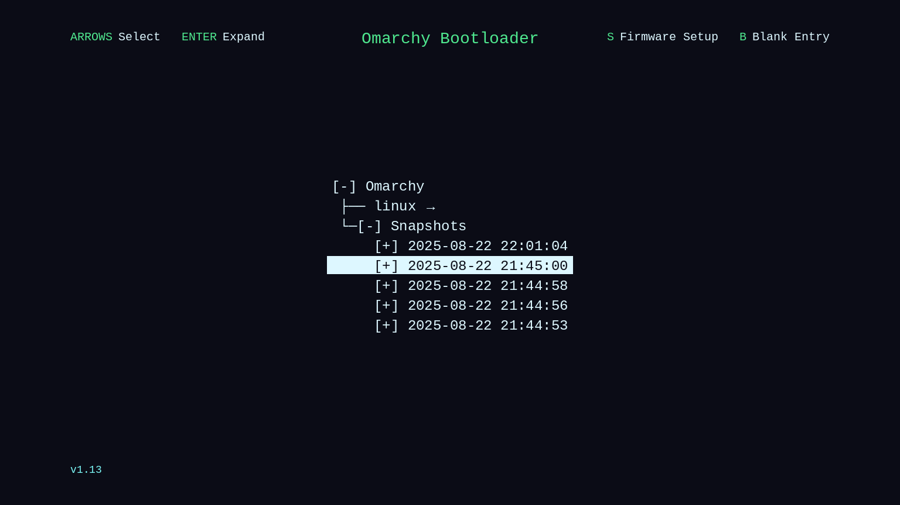
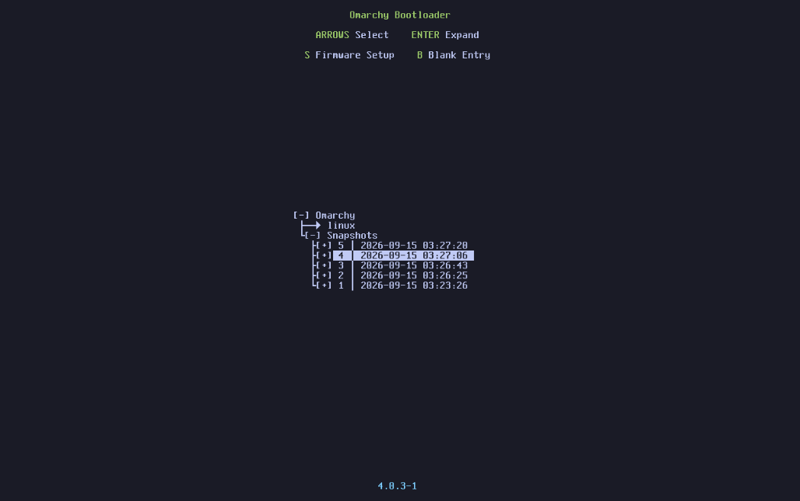
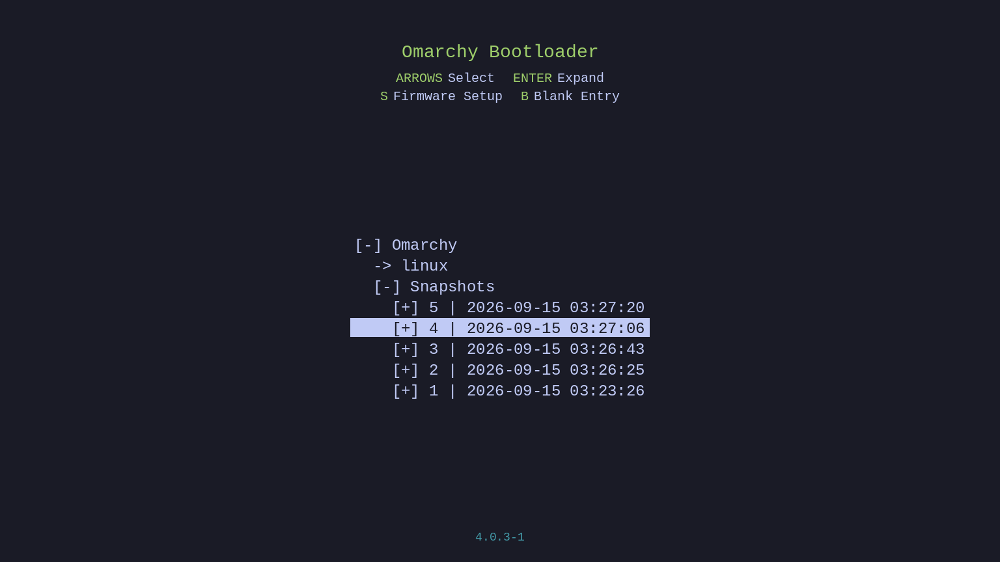

# OmaBoot

**Omarchy themes your desktop. OmaBoot carries the same palette into the Limine
bootloader — mockup previews in the Style menu, then a managed colour block in
`/boot/limine.conf`.**



Stock Omarchy paints Hyprland, the terminal, and your GTK apps. The boot menu
keeps the install-day Tokyo Night hex. Your desktop wears Hackerman neon; the
firmware menu still looks like 2024.

OmaBoot closes that gap the same way Style → Unlock works for Plymouth: a
labelled image picker, one mockup per installed theme, then sudo in Omarchy’s
floating terminal to patch `/boot/limine.conf`. Install / wipe stay in the
TTY you started. Boot is not user-land, so apply is **not** tied to
`omarchy theme set`.

## Goals (and honest limits)

These Style plugins extend Omarchy’s theme system **without requiring theme
authors — or you — to ship anything extra**. Official themes, your forks, and
third-party installs all work as long as they have a `colors.toml`. That
“every theme” contract is intentional: once the desktop can follow farther,
making *another* theme is more worth it. Longer origin / stop-line:
[Chroma](https://github.com/AlxWolfenstein97/chroma).

| Goal | What that means here |
|------|----------------------|
| Zero extra assets | No per-theme Limine art. Colours come from `colors.toml` alone. |
| Extreme compatibility | Stock + user + foreign themes all appear in the picker automatically. |
| True Theme Vibe | Mockups track **current** Limine chrome + your theme’s hex — **much closer**, if not identical, to what those colours look like on bare metal. Still **not** a framebuffer capture. |
| Carousel-safe | Mockups are 1536×864 (menu-images thumbnail size). Current Limine is dead-centered, so the 768×475 tile crop mostly shaves empty sides. |
| Snappy pickers | Mockups warm in parallel across CPU cores and **skip tiles whose `colors.toml` / branding / layout haven’t changed** — reopen is near-instant. On par with Omarchy’s stock Style carousels; Cursors often feels even snappier. |

We are **not** putting WYSIWYG screenshots in themes. Themes stay palette-only;
OmaBoot draws the chrome itself. True pixel-identical boot art would need QEMU /
reboot loops or per-theme bitmaps — that narrows the scope we refuse to narrow.
Plymouth Unlock looks “real” because Omarchy already ships unlock chrome; boot
does not, so we draw from the palette against a single Limine layout.

### Why a picker (and no theme-set hook)?

Boot needs sudo and only shows up after reboot — not something to rewrite on
every `omarchy theme set`. The Style carousel is still the point: preview how
Limine would wear **every** installed theme’s palette without rebooting twenty
times. Same “one surface, many themes, faster than manual” idea as OmaOBS /
OmaCursor / OmaVT.

## What you get

- **Style → Boot Themes** in the Omarchy menu — same carousel picker as Unlock /
  Theme / Background.
- **Live theme discovery** — every Omarchy theme with a `colors.toml` under
  `~/.config/omarchy/themes` or `$OMARCHY_PATH/themes`.
- **Mockups** — current Limine chrome (centered branding + help, snapshot tree
  with `N | timestamp`, inverse selection, version footer) coloured from that
  theme’s palette.
- **Safe patch** — one `### omaboot:start` … `### omaboot:end` block in
  `/boot/limine.conf`. Appended once if missing; replaced as a whole when you
  change themes. Boot entries, timeout, branding *text*, and any custom cmdline
  stay untouched — the patcher never rewrites non-colour lines.
- **No theme-set hook** — applying needs a password; pick when you mean it.

## Mockups: True Theme Vibe (not theme-bundled WYSIWYG)

Limine has no headless renderer, and we will not ask theme authors to ship boot
screenshots. Instead the drawer in `lib/omaboot.py` paints a **single** Limine
layout once, then recolours it from each theme’s `colors.toml`. At this point
the Tokyo Night mockup is close enough that asking for a framebuffer feels like
a joke — still not pixel-identical UEFI output, but the *vibe* is there.

**How it was done**

1. Grab a clean **current** Omarchy Limine screen in QEMU (crop the grey
   letterbox), on a real palette — Snapshots populated after a moment,
   `linux-omarchy` entry, **EFI fallback** sibling, selection on a snapshot row.
2. Trace that chrome in Pillow: centered branding, help under the title,
   `-> linux-omarchy` / Snapshots tree, `[+] N | timestamp` rows, inverse
   selection, `EFI fallback`, package version footer. Dead-centered so the
   Style carousel crop barely matters.
3. Recolour the same silhouette from every installed theme’s `colors.toml`.
   Themes stay palette-only; the plugin owns the art.

The [System snapshots](https://omarchy.org/manual/system-snapshots/) page of the
[Official Omarchy Manual](https://omarchy.org/manual/) still shows a Tokyo Night
boot screen from an older corner-help era — we don’t redistribute that shot.
This release tracks live Limine 12 / current Omarchy 4 chrome from our own QEMU
captures instead.

**Compare — real QEMU capture vs generated mockup (same chrome, Tokyo Night):**

| Real Limine (QEMU — grey letterbox cropped) | OmaBoot mockup |
| --- | --- |
|  |  |

Hero at the top is the same chrome on **Hackerman**. The real shot above is the
current Limine layout (`linux-omarchy`, Snapshots, **EFI fallback**) on
**Tokyo Night**; the mockup traces that silhouette from `colors.toml`. An earlier
in-house capture from **Omarchy 4.0.3** (stock `linux` kernel entry, no EFI
fallback row) is kept as
[`reference-limine-tokyo-night-legacy.png`](reference-limine-tokyo-night-legacy.png).


## Marketplace consent (hooks & Style menu)

Installing the plugin only drops the code. Style menu rows and theme-set hooks
edit your Omarchy config, so they stay **opt-in**.

**Fast path (no prompts)** — from your home folder:

```sh
~/.config/omarchy/plugins/io.github.alxwolfenstein97.omaboot/install.sh --yes
```

`--yes` means: I consent — arm everything this plugin supports, skip Y/n. Interactive `./install.sh` (no `--yes`) still asks — Workshop-safe; `--yes` / arm-all are optional shortcuts.
Style menu helper: `./tools/install-style-menu.sh --yes`.

**Arm the whole family in one shot** (after all plugins are installed):

```sh
~/.config/omarchy/plugins/io.github.alxwolfenstein97.chroma/tools/arm-all-family.sh
```

**Full wipe (this plugin)** — same ease as `install.sh --yes`
(full teardown + `plugin remove`; best-effort `pkg drop` for deps this plugin
may have pulled — kept only when pacman still needs them elsewhere):

```sh
~/.config/omarchy/plugins/io.github.alxwolfenstein97.omaboot/uninstall.sh --yes
```

**Wipe the whole family** (runs each plugin’s `uninstall.sh --yes` — same full
teardown as a single-plugin wipe — then a final shared-dep sweep):

```sh
~/.config/omarchy/plugins/io.github.alxwolfenstein97.chroma/tools/wipe-all-family.sh
```

Interactive `./install.sh` still asks [Y/n] if you prefer. Quiet shell restarts
only restore what you already armed. `./uninstall.sh --yes` is a full wipe for
that plugin (same teardown family wipe runs); without `--yes` you get TTY
prompts for optional package drops.


## Install

Workshop-style one paste (enable + integrate; installer asks [Y/n]):

```bash
omarchy plugin add https://github.com/AlxWolfenstein97/omaboot.git --enable
~/.config/omarchy/plugins/io.github.alxwolfenstein97.omaboot/install.sh
```

That clones into `~/.config/omarchy/plugins/io.github.alxwolfenstein97.omaboot` and arms hooks / Style after you
confirm. Skip prompts: `~/.config/omarchy/plugins/io.github.alxwolfenstein97.omaboot/install.sh --yes`.

Or from an existing checkout:

```bash
~/.config/omarchy/plugins/io.github.alxwolfenstein97.omaboot/install.sh
omarchy plugin enable io.github.alxwolfenstein97.omaboot
```


## How it works

1. `bin/omaboot-switcher` renders PNG mockups into
   `~/.cache/omarchy/omaboot/previews/`, then opens `omarchy-menu-images`.
2. On selection, Style launches Omarchy’s floating terminal running `omaboot-set`
   (same privilege pattern as Unlock), which prompts for sudo and patches
   `/boot/limine.conf`. Install / uninstall / arm-all / wipe use the same TTY.
3. Colour keys (`term_*`, `backdrop`, branding/help colours) live inside the
   managed block. Everything else in the file is preserved.

CLI:

```sh
omaboot list
omaboot preview              # warm all mockups
omaboot switcher             # picker → prints slug
omaboot show tokyo-night     # print managed block
omaboot set tokyo-night      # patch limine.conf (sudo)
omaboot set tokyo-night --dry-run
omaboot current
```

## Disable vs remove

| Action | What happens |
|--------|----------------|
| `omarchy plugin disable …` | Shell service stops. No theme-set hook — last limine colour block stays. |
| `./uninstall.sh` then disable / remove | Menu + cache/state gone. Tombstone + disable **first**. This TTY runs `omaboot clear` (sudo) — restores **Omarchy default Limine colours (Tokyo Night)**, drops `### omaboot` markers (not bare Limine greys). Optional y/N `pkg drop`. |
| `omarchy pkg drop python-pillow` | Optional. TTY uninstall prompts show why + `pacman Required By` (MangoHud etc.). Clear/uninstall still work without Pillow. Drop may fail if other pkgs need it — that is fine. |

Quiet Service install (`--quiet`): restores already-armed wiring only. Deps + Style consent come from interactive `install.sh`, `--yes`, or
family `arm-all-family.sh`. Menu written only if `// omaboot:start` markers are
missing; `omarchy.menu refresh` + `shell rescanPlugins` so Style rows show without
a manual shell restart; also scrubs orphan Style rows for siblings removed without
`uninstall.sh`.

Omarchy `plugin remove` never runs `uninstall.sh` (dir delete only) — always
`./uninstall.sh` first so this TTY can restore Omarchy Tokyo Night boot paint.

**Full wipe** — one shot (`--yes` skips pkg Y/n, best-effort drops deps this plugin may have pulled if nothing else needs them, and removes the plugin):

```sh
~/.config/omarchy/plugins/io.github.alxwolfenstein97.omaboot/uninstall.sh --yes
```

## Fresh VM smoke test

```sh
omarchy plugin add https://github.com/AlxWolfenstein97/omaboot.git --enable
# Style → Boot Themes appears without a shell restart; carousel tiles warm (needs python-pillow)
# Pick a loud theme; confirm the surface updates (reboot → Limine matches; uninstall restores Omarchy Tokyo Night)
# plugin add alone + reboot → quiet restores wiring only; run install.sh / arm-all for deps/hooks
# Parallel install.sh: shared Pillow flock; siblings only ask for their own missing pkgs
# ./uninstall.sh → this TTY: omaboot clear → Tokyo Night + optional itemized pkg drop
# Skip pkg prompts (n) + disable → reinstall → uninstall again → answer y if you want drops
# With mangohud/goverlay kept, Pillow drop may fail — fine; clear/uninstall still work without Pillow
```

## Limits, honestly

- Limine only reads the conf at boot — reboot to see the new palette on bare
  metal.
- There is no separate Plymouth-style **Default** tile: Omarchy’s stock Limine
  palette is Tokyo Night in practice, so pick **Tokyo Night** for install-day
  colours.
- `omarchy refresh limine` replaces the whole conf from Omarchy defaults; run
  Boot Themes again afterwards if you still want a themed palette.

## Check

```sh
bash ~/.config/omarchy/plugins/io.github.alxwolfenstein97.omaboot/check.sh
```

## Credits

- **Layout reference:** [`reference-limine-tokyo-night.png`](reference-limine-tokyo-night.png)
  — QEMU capture of current Omarchy Limine on Tokyo Night (`linux-omarchy`,
  Snapshots, EFI fallback; grey letterbox cropped). Compare mockup:
  [`preview-tokyo-night.png`](preview-tokyo-night.png). Earlier **Omarchy 4.0.3**
  capture (stock `linux` entry, no EFI fallback):
  [`reference-limine-tokyo-night-legacy.png`](reference-limine-tokyo-night-legacy.png).
- Hero mockup: official **Hackerman** theme (the loudest stock neon Omarchy
  ships).
- Sibling plugins: [OmaOBS](https://github.com/AlxWolfenstein97/omaobs),
  [OmaVT](https://github.com/AlxWolfenstein97/omavt),
  [OmaTTY](https://github.com/AlxWolfenstein97/omatty),
  [OmaCursor](https://github.com/AlxWolfenstein97/omacursor),
  [OmaHud](https://github.com/AlxWolfenstein97/omahud),
  [Chroma](https://github.com/AlxWolfenstein97/chroma).
- [Omarchy](https://omarchy.org/) — theme pipeline, Style menu image picker,
  and Limine defaults this plugin patches carefully.

## License

MIT — see [LICENSE](LICENSE).
